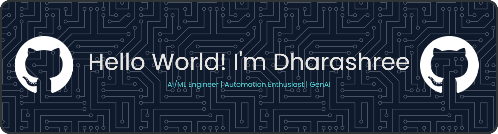

<!--
**dharashreemsr/dharashreemsr** is a ✨ _special_ ✨ repository because its `README.md` (this file) appears on your GitHub profile.

Here are some ideas to get you started:

- 🔭 I’m currently working on ...
- 🌱 I’m currently learning ...
- 👯 I’m looking to collaborate on ...
- 🤔 I’m looking for help with ...
- 💬 Ask me about ...
- 📫 How to reach me: ...
- 😄 Pronouns: ...
- ⚡ Fun fact: ...
-->
## 🚀 About Me
- 🔭 I’m currently working on **Customer Sentiment Automator**
- 🌱 I’m currently learning **MongoDB**
- 👯 I’m looking to collaborate on **NLP and automation workflows**
- 💬 Ask me about **building intelligent automation systems, deploying ML models, and Linux system administration**
- 📫 How to reach me: 
  

## 🛠️ Skills / Tech Stack

#### **Programming Languages**

#### **Frameworks & Libraries**

<!-- Flask -->
<!-- Streamlit --><!-- FastAPI --><!-- Scikit-learn --><!-- TensorFlow --><!-- PyTorch --><!-- XGBoost --><!-- OpenCV --><!-- MediaPipe --><!-- spaCy --><!-- NLTK --><!-- HuggingFace Transformers --><!-- NumPy --><!-- Pandas -->

#### **Tools & Technologies**

<!-- Git -->
<!-- GitHub --><!-- Linux --><!-- n8n --><!-- Postman --><!-- MongoDB 
--><!-- MySQL --><!-- PostgreSQL --><!-- Power BI --><!-- Tableau -->

<!--
#### **Certifications**

<!-- RHCSA -->
<!--

  

-->
